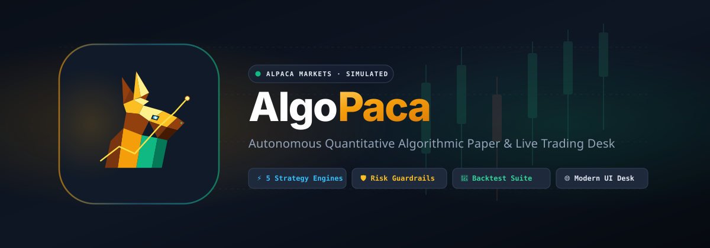

<p align="center">
  
</p>

<p align="center">
  <strong>Autonomous Algorithmic Paper &amp; Live Trading Desk</strong><br>
  <em>6 Algorithmic &amp; Intraday Engines • Exit Strategies &amp; Bracket Stops • Custom Blueprints • Options Overlay • 4 AI Providers • Auto-Trade Approval Queue • Multi-User Auth &amp; Admin • Mobile PWA &amp; Web Desk</em>
</p>

<p align="center">
  <a href="https://algopaca.spiderdevs.xyz/"></a>
  <a href="https://x.com/ehjewelbd/status/2090872372731711646"></a>
  <a href="LICENSE"></a>
  
  
  
  
  
  
</p>

<p align="center">
  <a href="https://algopaca.spiderdevs.xyz/">Live Demo</a> •
  <a href="#-watch-in-action-demo--walkthrough">Demo Video</a> •
  <a href="#-key-features">Features</a> •
  <a href="#-strategy-engines--options-overlay">Strategies &amp; Options</a> •
  <a href="#-mobile-app--web-trading-desk">Mobile &amp; Web Desk</a> •
  <a href="#-multi-user-workspaces-auth--admin">Auth &amp; Admin</a> •
  <a href="#-quickstart">Quickstart</a> •
  <a href="#-mcp-server-claude-cursor-and-other-ai-assistants">MCP Server</a> •
  <a href="#-cli--terminal-execution">CLI Usage</a> •
  <a href="#%EF%B8%8F-configuration-env">Configuration</a> •
  <a href="#-risk-management--safety-guardrails">Risk Safety</a> •
  <a href="#-contributing">Contributing</a>
</p>

---

AlgoPaca is a **100% free, MIT-licensed, full-stack quantitative trading desk** built natively for [Alpaca Markets](https://alpaca.markets) with **$0 commission stock & ETF trading**. It democratizes algorithmic and AI-driven trading by replacing expensive monthly SaaS bot subscriptions with a self-hosted, institutional-grade platform featuring **6 algorithmic & intraday trading engines**, **automated position exit strategies & bracket protection**, **customizable strategy blueprints**, an **Alpaca options overlay**, **multi-provider AI reasoning** (OpenAI, Google Gemini, Anthropic Claude, xAI Grok), **mechanical risk guardrails**, an **auto-trade approval queue**, an interactive **walk-forward daily & intraday backtesting suite**, a **multi-user authentication & admin dashboard**, and a fast, responsive **web & mobile trading desk**.

> [!NOTE]
> 💸 **100% Free Platform & Commission-Free Trading**:
> AlgoPaca is completely free & open source with **zero monthly subscription fees** and **zero paywalls**. Combined with Alpaca Markets' native API for US equities and ETFs, you get automated quant trading with **$0 platform costs and $0 brokerage commissions**.

---

## 🎬 Watch in Action (Demo & Walkthrough)

Check out the launch walkthrough video and feature demonstration on **𝕏 (Twitter)**:

<p align="center">
  <a href="https://x.com/ehjewelbd/status/2090872372731711646">
    
  </a>
</p>

> [!TIP]
> 📺 **Launch Announcement & Video Walkthrough**:  
> _"🚨 Introducing AlgoPaca — A fully autonomous AI Quantitative Trading Desk for @AlpacaMarkets 🦙🤖 Fuses Technicals + Live News + Nasdaq Earnings + Macro events with automated ATR risk guardrails."_  
> 🔗 **Direct Link:** [https://x.com/ehjewelbd/status/2090872372731711646](https://x.com/ehjewelbd/status/2090872372731711646)

---

## 🌟 Why AlgoPaca?

- 💸 **100% Free & Commission-Free Trading**: No recurring monthly subscription tiers, no hidden platform fees, and $0 commission US stock & ETF trading natively via Alpaca Markets.
- ⚡ **Intraday Day Trading Engine**: High-frequency intraday engine designed for 1m, 5m, and 15m intervals with VWAP trend riding, Opening Range Breakout (ORB 15m), fast momentum scalping, and mean-reversion fading, paired with AI trade vetoes and automatic EOD position square-off.
- 🛡️ **Automated Exit Strategies & Position Protection**: Interactive position management directly from the Positions desk — set fixed Stop Loss, Breakeven Ratchet ($entry ± $0.01), Trailing Stop Loss (%), Take Profit targets, or full Bracket orders with single-click execution.
- 🧠 **Multi-Provider AI Intelligence**: Seamlessly switch between top-tier LLMs—**OpenAI** (GPT-4o, GPT-4o-mini, o3-mini), **Google Gemini** (Gemini 2.0 Flash, Gemini 1.5 Pro), **Anthropic Claude** (Claude 3.7 Sonnet, Claude 3.5 Sonnet, Claude 3.5 Haiku), and **xAI Grok** (Grok-2, Grok-beta)—to fuse quantitative technical indicators, financial news sentiment, Nasdaq earnings surprises, and macroeconomic calendar events into reasoned JSON trading decisions.
- 🛠️ **Custom Trading Engines & Starter Blueprints**: Save any active desk setup—strategy parameters, custom AI prompts, risk limits, and indicator gates—as a reusable Custom Engine, or launch instantly from 7 pre-built starter blueprints.
- 🎯 **Alpaca Options Overlay**: Automatically map algorithmic and AI signals onto defined-risk options strategies (vertical debit spreads, long calls/puts, and covered hedges) with automated strike and DTE selection.
- 🚦 **Auto-Trade & Human-in-the-Loop Approval Queue**: Choose between full autonomous continuous execution or **Approval Mode**, where candidate trades are staged in an approval queue with full reasoning, entry/exit levels, and risk metrics for single-click review.
- 📱 **Mobile-First App Experience (PWA)**: Complete responsive mobile shell featuring a native-feeling top app header, bottom navigation bar, slide-out drawer, mobile order ticketing, and fast touch interactions.
- 👥 **Multi-User Workspace & Admin Suite**: Complete user isolation with secure signup, login, password resets via SMTP, setup wizard onboarding, Owner/Admin/Member role elevation, user-scoped API keys, and comprehensive audit logs.
- 📋 **Advanced Order Execution & Lot Batch Liquidation**: Execute Market, Limit, Stop, Stop-Limit, Trailing Stops ($, %), Bracket, OCO, and OTO orders. Chain post-fill follow-on **Next-Tickets**, partially scale out of positions (25%, 50%, 75%), and selectively batch-liquidate individual tax lots with FIFO calculation and resting order safeguards.
- 🛡️ **Mechanical Risk Protection**: Removes emotional decision-making with strict volatility-based ATR position sizing, automatic trailing stops, profit scaling, spread checks, and daily drawdown circuit breakers.
- 🧪 **Daily & Intraday Backtesting Suite**: Walk-forward simulations on historical daily or minute bars with realistic execution, intra-bar conservative stop-first resolution, slippage simulation, and side-by-side comparison analytics.
- 🔌 **MCP Server for AI Assistants**: A built-in [Model Context Protocol](https://modelcontextprotocol.io) server exposes AlgoPaca's engines and account tools, allowing Claude Desktop, Cursor, and AI agents to check portfolio status, run strategy cycles, place orders, and backtest directly.
- ⚡ **Zero-Build Web Desk**: Ultra-fast, lightweight Vanilla JS/CSS web desk with real-time portfolio metrics, cycle audit logs, performance attribution, and multi-language internationalization (English, Bengali, Spanish, French, Hindi).
- 🐳 **1-Click Deployment**: Get up and running in 60 seconds with Docker Compose or standard Python virtual environments.

---

## ✨ Key Features

- 📈 **6 Algorithmic & Intraday Trading Engines**:
  1. **Intraday & Day Trading Engine** — High-speed intraday engine on 1m, 5m, or 15m intervals featuring VWAP trend following, Opening Range Breakout (ORB 15m), fast momentum scalping, and mean-reversion fading, backed by AI trade veto and automatic End-Of-Day (EOD) position square-off.
  2. **Classic SMA Crossover** — Moving average trend-following across watchlist tickers with multiple proven presets (Golden Cross, Swing, Fibonacci, etc.).
  3. **Buy the Dip** — Oversold mean-reversion with RSI + lower Bollinger wash entries and recovery exits.
  4. **Long & Short Pair Rotator** — Dynamic regime-impulse rotator between two correlated/inverse symbols (e.g., QLD / QURL or TQQQ / SQQQ).
  5. **Regime Dual Momentum (L/S)** — Daily EMA + ADX regime gate with MACD histogram triggers and ATR-based risk sizing.
  6. **AI Quantitative Desk** — Multi-modal LLM engine synthesizing Technicals, News Sentiment, Nasdaq Earnings, and Forex Factory Economic Releases into structured JSON trading decisions.
  7. **Custom Trading Engines & Starter Blueprints** — Save, duplicate, customize, and switch between named custom trading engines with tailored rules, AI instructions, and mechanical risk parameters.
- 🛡️ **Automated Exit Strategies & Trade Management**:
  - **Stop Loss**: Quick risk distance chips (1%, 2%, 3%, 5%, 8%, 10%) or custom dollar levels with instant GTC stop placement.
  - **Zero-Risk Breakeven**: One-click ratchet that moves your protective stop to average entry price ($entry ± $0.01) to eliminate capital risk on profitable trades.
  - **Trailing Stop Loss**: Dynamic percentage-based trailing stop ($1%–10%$) that locks in unrealized profits as price expands.
  - **Take Profit Target**: Pre-set target limit price to secure gains at key resistance levels.
  - **Full Bracket Protection**: Combined Take Profit and Stop Loss orders with automated synchronization.
  - **Partial Liquidation**: Scale out of positions by exact share quantities or percentage presets (25%, 50%, 75%, 100%) with live proceeds and P&L estimation.
  - **Resting Order Conflict Safeguards**: Automatically identifies and cancels conflicting resting stop/limit orders before executing position closures to prevent race conditions and duplicate executions.
- 🛠️ **Custom Trading Engines & Starter Blueprints**:
  - Save any combination of strategy parameters, prompt instructions, indicator triggers, and risk rules as a persistent, user-isolated **Custom Engine**.
  - Includes ready-to-trade **Starter Blueprints**: *AI Trend & Volatility Surfer*, *AI Deep Dip Hunter*, *Earnings Catalyst & News Momentum*, *Dynamic SMA ATR Shield*, *Regime Momentum L/S*, *Quant RSI Dip Hunter*, and *Statistical Relative Strength Pair*.
  - Instant 1-click loading, dirty state detection with "Modified" badge indicators, in-place updating, blueprint duplication, and safe deletion.
- 🎯 **Alpaca Options Overlay**:
  - Automatically translates equity signals into defined-risk options contracts.
  - Supports **Vertical Debit Spreads** (Call/Put spreads for capped risk/reward), **Long Options** (ATM calls/puts), and **Covered Hedges** (Protective puts and covered calls).
  - Dynamic DTE filtering (21–45 DTE target range), delta/moneyness targeting, and maximum premium allocation caps.
- 🤖 **4 Leading AI Providers**:
  - Full support for **OpenAI**, **Google Gemini**, **Anthropic Claude**, and **xAI Grok**.
  - Custom system prompts and named presets: *Balanced*, *Conservative*, *Momentum*, *Mean Reversion*, *News Aware*, *PEAD (Post-Earnings Announcement Drift)*, *ORB (Opening Range Breakout)*, and *Custom*.
- 🚦 **Auto-Trade & Approval Queue**:
  - **Autonomous Mode**: Runs scheduled strategy cycles and executes cleared signals automatically.
  - **Approval Mode (Human-in-the-Loop)**: Places recommended trades into an interactive staging queue with full AI rationale, confidence score, technical breakdown, and position size for review before execution.
- 📝 **Advanced Order Desk & Next-Ticket Chaining**:
  - **Order Types**: Market, Limit, Stop, Stop-Limit, Trailing Stop ($ and %), Bracket (Take Profit + Stop Loss), OCO (One-Cancels-Other), and OTO (One-Triggers-Other).
  - **Next-Ticket Lifecycle**: Configure conditional follow-on orders that automatically arm and execute once a primary order fills, without premature cancellation.
- 📦 **Position Lots Modal & Batch Lot Liquidation**:
  - Inspect individual tax lots for any open position (entry timestamp, qty, fill price, current value, unrealized P&L).
  - Multi-select lots with real-time aggregate cost/gain calculation.
  - Safe batch liquidation with FIFO disclaimers and automatic cancellation of conflicting resting stop/limit orders.
- 👥 **Multi-User Isolation, Auth & Admin Suite**:
  - Multi-user tenant architecture: user data, Alpaca paper/live keys, AI API keys, and trading settings are strictly isolated per user.
  - First-time setup onboarding wizard for effortless deployment and Owner account creation.
  - Role-Based Access Control (RBAC): *Owner*, *Admin*, and *Member* roles with permission elevation.
  - Built-in SMTP email service for password reset delivery and system notifications with live test email dispatch.
  - User Settings page for managing profile, password security, trade alerts, and workspace preferences.
  - Comprehensive Admin Dashboard with user directory, role management, audit logs, and server configuration.
- 📱 **Modern Responsive Web & Mobile App Shell (PWA)**:
  - Mobile-first UX with fixed top app bar, bottom navigation, touch-optimized cards, and slide-out navigation drawer.
  - Real-time portfolio tracking, cycle audit logs, trade history analytics, and multi-language support (English, Bengali, Spanish, French, Hindi).
- 🛡️ **Autonomous Mechanical Risk Engine**:
  - Pre-execution risk gates enforcing position sizing (`equity × risk% ÷ ATR`), trailing stop-losses, take-profit scaling, max concurrent positions, daily drawdown circuit-breakers, spread checks, and post-loss cooldowns.
- 🧪 **Interactive Backtest & Comparison Suite**:
  - Walk-forward simulations on historical daily/minute bars with side-by-side run comparisons (CAGR, Sharpe Ratio, Max Drawdown, Win Rate, Profit Factor, Equity Curve visualization).
- 🔒 **Dual-Slot Paper & Live Trading Safety**:
  - Strict separation of Paper and Live credentials with hard killswitches, context resets, and automatic fallback safeguards.

---

## 📊 Strategy Engines & Options Overlay

| Engine | Strategy Type | Core Logic | Highlights & Presets |
| :--- | :--- | :--- | :--- |
| **Day Trading** | Intraday & Scalping | High-frequency minute-bar execution (1m/5m/15m) using VWAP, Opening Range Breakout (ORB), and 9/21 EMA momentum | **AI Institutional VWAP & Momentum**, **AI Opening Range Sniper (15m)**, **AI Adaptive Intraday Scalper**, **VWAP Trend Rider**, **Opening Range Breakout**, **Intraday Momentum Scalp**, **VWAP Mean Reversion (Fade)**, or **Custom**. |
| **SMA** | Trend Following | Moving average crossover filters across watchlist | **Classic** (10/30), **Short-term** (5/20), **Fibonacci** (8/21), **Swing** (20/50), **Golden Cross** (50/200), or **Custom**. |
| **Dip** | Mean Reversion | Capitulation washouts & recovery bounces | RSI threshold washouts + Bollinger lower band taps. Presets: **Deep**, **Mild pullback**, **Washout**, **Custom**. |
| **Pair** | Regime Rotation | Dynamic regime-impulse rotation across 2 symbols | Holds long leg in bull regimes; rotates into short leg on confirmed bear impulses (e.g. 7-day drop ≤ -5% below SMA). |
| **LS** | Dual Momentum | Trend strength momentum (Long/Short) | EMA fast/slow + ADX trend strength gate. Holds through chop, exits on signal flip, ATR stop, or R:R target. |
| **AI Desk** | Multi-Factor Quant | LLM multi-modal market synthesis & reasoning | TA (RSI, MACD, BB, ATR, ADX) + News + Earnings + Macro events → JSON decision → risk-sized orders. Presets: **Balanced**, **Conservative**, **Momentum**, **Mean Reversion**, **PEAD**, **ORB**, **Custom**. |
| **Custom Engines** | User-Defined & Blueprints | Composable strategies & starter templates | Save, clone, and switch custom rules, custom AI directives, and risk parameters across any base engine. |
| **Options Overlay** | Defined-Risk Derivatives | Maps equity signals directly to Alpaca options | **Vertical Debit Spreads** (Bull Call / Bear Put spreads), **Long Options** (ATM calls/puts), **Covered Hedges** (Protective puts / Covered calls). |

### ⚡ Intraday Day Trading Engine & Presets

The Day Trading engine is built specifically for intraday US equity and ETF market sessions with strict session risk rules:

- **Sub-Modes**:
  - `vwap_trend` — Trend following above intraday VWAP with fast 9/21 EMA alignment and 2R profit target.
  - `orb` — Volume-confirmed 15-minute Opening Range Breakout with dynamic ATR trailing stops.
  - `momentum_scalp` — Fast 9/21 EMA crossovers confirmed by RSI > 55 and ADX trend filters for quick intraday scalps.
  - `vwap_fade` — Mean-reversion buying confirmed oversold bounces off the lower VWAP standard deviation band in range-bound markets.
- **AI Second-Opinion Confirmation**: When enabled (`use_ai_confirm=True`), trading candidates are evaluated against real-time financial news sentiment and macro catalysts by your configured AI provider; setups with confidence below the threshold (default: 0.65–0.70) are safely vetoed.
- **Market Open Buffer & EOD Square-Off**: Enforces an opening bell buffer (e.g. 15 minutes) to avoid opening volatility whipsaws, limits maximum round-trip trades per day, and automatically squares off open intraday positions before the closing bell (`day_eod_flatten_mins=15`).

### 🎯 Options Overlay in Action

When enabled, the Options Overlay automatically converts strategy signals into options trades:
- **Defined Risk**: Vertical debit spreads cap maximum possible loss to the net premium paid.
- **Expiry Targeting**: Scans the Alpaca option chain for optimal expirations (default: 21–45 DTE).
- **Strike Selection**: Selects ATM/OTM strikes based on target moneyness (e.g., 5% OTM for wing legs).
- **Risk Limits**: Caps maximum contracts and total premium as a percentage of account equity.

---

## 📱 Mobile App & Web Trading Desk

AlgoPaca includes both a desktop trading terminal and an optimized **Mobile-First PWA Shell**:

- **Mobile Shell**: Designed for smartphones and tablets with a sticky top bar, bottom navigation (Desk, Orders, Auto-Trade, Positions, Menu), and a slide-out navigation drawer.
- **Positions Desk, Exit Strategies & Lot Liquidation**:
  - View summary cards for all open equity and option positions with real-time mark-to-market prices and P&L.
  - Open the **Exit Strategy Modal** to configure fixed Stop Loss, Breakeven Ratchet, Trailing Stops, Take Profit, or full Bracket orders.
  - Scale out partially with the **Partial Close Modal** (25%, 50%, 75%, 100% or custom shares) with live proceeds previews.
  - Drill down into individual tax lots (entry price, date, unrealized gain/loss).
  - Select specific lots to liquidate in batch with real-time aggregate cost/gain calculation and automatic cancellation of conflicting resting orders.
- **Auto-Trade Desk & Day Trading Control**:
  - Seamlessly switch between Daily and Intraday Day Trading engines.
  - Configure intraday intervals (1Min, 5Min, 15Min), strategy sub-modes, AI confirmation thresholds, and EOD square-off times directly from the web desk.
- **Orders Desk & Advanced Ticket Creation**:
  - Manage open, filled, and cancelled orders in real time.
  - Construct complex order tickets: Bracket, OCO, OTO, Trailing Stop ($ / %), Limit, and Stop-Limit.
  - Set up chained **Next-Tickets** that arm upon order fill.
- **API Keys & Configuration**:
  - Manage user-isolated Alpaca Paper & Live keys, as well as OpenAI, Gemini, Anthropic, and xAI API keys with live connection verification.
- **History & Performance Attribution**:
  - Visual charts of equity growth, win/loss distribution, sector performance, and AI trade reflection audit logs.

---

## 👥 Multi-User Workspaces, Auth & Admin

AlgoPaca provides complete multi-user isolation, making it suitable for single traders, teams, or hosted multi-tenant deployments:

- **User Authentication**: Secure sign-up, session-based login, and password reset flows.
- **Setup Wizard**: Automatically launches on initial setup to guide the administrator through creating the Owner account, configuring SMTP email, and setting default parameters.
- **Role-Based Access Control (RBAC)**:
  - **Owner**: Full system control, user management, role elevation, SMTP configuration, and global settings.
  - **Admin**: User directory access, workspace monitoring, and operational controls.
  - **Member**: Fully isolated trading workspace with dedicated Alpaca and AI API keys.
- **User Settings**: Dedicated user settings portal for updating profile details, changing passwords, configuring trade notification preferences, and selecting default UI themes/languages.
- **Admin Dashboard**: Centralized dashboard for user directory management, role promotion/demotion, system health statistics, SMTP server configuration, and test email delivery.

---

## 🚀 Quickstart

> [!TIP]
> 🌐 **Try it live first**: **[algopaca.spiderdevs.xyz](https://algopaca.spiderdevs.xyz/)** is a hosted instance of the multi-user desk — sign up and connect your own Alpaca paper keys without installing anything.

### Option 1: Run with Docker & Docker Compose (Recommended)

The easiest way to spin up AlgoPaca with zero manual Python environment configuration:

```bash
# 1. Clone the repository
git clone https://github.com/mdjwel/algopaca.git
cd algopaca

# 2. Copy and configure environment variables
cp .env.example .env

# 3. Start AlgoPaca container in background
docker compose up -d
```

Open your browser at **[http://localhost:8765](http://localhost:8765)**.

To stop the container:

```bash
docker compose down
```

---

### Option 2: Local Python Setup (macOS / Linux / Windows)

#### Prerequisites

- **Python 3.10, 3.11, or 3.12**
- **Git**
- Free [Alpaca Paper Trading Account](https://app.alpaca.markets/paper/dashboard/overview)

#### macOS & Linux:

```bash
# 1. Clone the repository
git clone https://github.com/mdjwel/algopaca.git
cd algopaca

# 2. Create and activate virtual environment
python3 -m venv .venv
source .venv/bin/activate

# 3. Install dependencies
pip install -r requirements.txt

# 4. Configure environment
cp .env.example .env

# 5. Launch the Web Trading Desk
./launch_web.sh
```

#### Windows (Command Prompt or PowerShell):

```cmd
:: 1. Clone and navigate to folder
git clone https://github.com/mdjwel/algopaca.git
cd algopaca

:: 2. Launch web desk (automatically sets up .venv & dependencies)
launch_web.bat
```

Open **[http://127.0.0.1:8765](http://127.0.0.1:8765)** to complete the setup wizard and access your trading desk.

---

## 🔌 MCP Server (Claude, Cursor, and other AI assistants)

AlgoPaca ships its own [Model Context Protocol](https://modelcontextprotocol.io) server on top of the same `alpaca-py` Trading API client the CLI and web desk use. It exposes AlgoPaca's five strategy engines, mechanical risk gates, options overlay, and backtester as structured tools, so an AI assistant like Claude or Cursor can check the account, run a strategy cycle, place/close orders, and backtest — all through tool calls instead of the web UI.

```bash
# 1. Configure .env (paper credentials by default — see Configuration below)
cp .env.example .env

# 2. Launch the MCP server (stdio transport)
./run_mcp.sh          # macOS / Linux
run_mcp.bat           # Windows
```

**Available tools:**

| Tool | What it does |
| :--- | :--- |
| `get_account` | Equity, cash, buying power, paper/live status, day P&L |
| `get_positions` | All open positions (stocks, ETFs, and options) |
| `get_open_orders` | Open orders grouped by symbol, with protective-stop metadata |
| `list_strategy_presets` | Named parameter presets for an engine (e.g. `sma` → `golden_cross`, `ai` → `balanced`) |
| `run_strategy_cycle` | Evaluate + (if a signal clears every risk gate) execute one engine's cycle, including its options overlay |
| `place_manual_order` | User-directed market/limit/stop/trailing order, with bracket/OTO stop-loss & take-profit |
| `close_position` | Liquidate a position fully or partially |
| `run_backtest` | Walk-forward backtest an SMA or dip strategy on historical bars (no orders) |

Add it to Claude Desktop's `claude_desktop_config.json` (or Cursor's MCP settings) as a local stdio server:

```json
{
  "mcpServers": {
    "algopaca": {
      "command": "/absolute/path/to/algopaca/.venv/bin/python",
      "args": ["-m", "bot.mcp_server"],
      "cwd": "/absolute/path/to/algopaca"
    }
  }
}
```

> [!NOTE]
> The server inherits AlgoPaca's paper/live safety model straight from `.env` — every tool call runs against Alpaca paper by default, and live trading only activates when `ALPACA_PAPER=false` and `ALPACA_ALLOW_LIVE=true` are both set. There is no way to flip environments per tool call.

---

## 💻 CLI & Terminal Execution

AlgoPaca provides a full-featured terminal CLI for headless servers, automated cron jobs, or scriptable executions:

```bash
# Display connected Alpaca account status and buying power
./run.sh --account

# Run a single strategy evaluation cycle
./run.sh --once --mode sma --sma-preset golden_cross
./run.sh --once --mode dip --dip-preset deep
./run.sh --once --mode pair
./run.sh --once --mode ls
./run.sh --once --mode ai --provider openai --preset balanced
./run.sh --once --mode ai --provider gemini --preset momentum
./run.sh --once --mode ai --provider anthropic --preset pead
./run.sh --once --mode ai --provider xai --preset balanced

# Run continuous autonomous loop (polls at configured intervals)
./run.sh --mode ai --provider gemini --preset balanced

# Override symbols for a cycle
./run.sh --once --mode sma --symbols AAPL,MSFT,NVDA,TSLA
```

_(On Windows, replace `./run.sh` with `run.bat`)_

---

## ⚙️ Configuration (`.env`)

AlgoPaca uses environment variables for default configuration. All settings can also be modified in real-time via the **API Keys** and **Settings** pages in the Web Desk.

```env
# ==========================================
# Alpaca Paper Trading Credentials (Default)
# ==========================================
ALPACA_API_KEY=PK...
ALPACA_SECRET_KEY=...
ALPACA_PAPER=true

# ==========================================
# Alpaca Live Trading Credentials (Safety Guarded)
# ==========================================
ALPACA_LIVE_API_KEY=AK...
ALPACA_LIVE_SECRET_KEY=...
ALPACA_ALLOW_LIVE=false

# ==========================================
# AI Model Providers & Keys (OpenAI, Gemini, Anthropic, xAI)
# ==========================================
OPENAI_API_KEY=sk-...
OPENAI_MODEL=gpt-4o-mini

GEMINI_API_KEY=...
GEMINI_MODEL=gemini-2.0-flash

ANTHROPIC_API_KEY=sk-ant-...
ANTHROPIC_MODEL=claude-3-7-sonnet-latest

XAI_API_KEY=xai-...
XAI_MODEL=grok-2-latest

AI_PROVIDER=openai

# ==========================================
# Default Strategy Settings
# ==========================================
STRATEGY_MODE=sma           # sma | dip | pair | ls | ai | day
SYMBOLS=AAPL,MSFT,NVDA,SPY,QQQ
SMA_PRESET=classic
DIP_PRESET=deep
AI_PRESET=balanced

# ==========================================
# Intraday Day Trading Configuration
# ==========================================
DAY_PRESET=ai_vwap_momentum # ai_vwap_momentum | ai_orb_breakout | ai_adaptive_scalp | vwap_trend | orb_breakout | momentum_scalp | vwap_fade | custom
DAY_SUB_MODE=vwap_trend     # vwap_trend | orb | momentum_scalp | vwap_fade
DAY_SIDE=long_only          # long_only | long_short
DAY_EMA_FAST=9
DAY_EMA_SLOW=21
DAY_ORB_MINUTES=15          # Opening range duration (minutes)
DAY_OPEN_BUFFER_MINS=15     # Minutes to wait after market open before trading
DAY_EOD_FLATTEN=true        # Automatically close positions before market close
DAY_EOD_FLATTEN_MINS=15     # Minutes before market close to square off positions
DAY_MAX_TRADES_PER_DAY=5    # Maximum round-trip trades allowed per session
DAY_PROFIT_TARGET_R=2.0     # Profit target (multiple of initial risk)
DAY_STOP_ATR_MULT=1.5       # ATR stop-loss multiplier
DAY_USE_AI_CONFIRM=true     # AI second-opinion catalyst validation
DAY_AI_MIN_CONFIDENCE=0.70  # Minimum AI confidence required to execute trade

# ==========================================
# Options Overlay Configuration
# ==========================================
OPTIONS_ENABLED=true
OPTIONS_STYLE=vertical      # vertical (debit spread) | long_option | hedge
OPTIONS_DTE_MIN=21
OPTIONS_DTE_MAX=45
OPTIONS_OTM_PCT=5.0
OPTIONS_MAX_CONTRACTS=1
OPTIONS_MAX_PREMIUM_PCT=1.0

# ==========================================
# Mechanical Risk Engine
# ==========================================
AI_RISK_PCT=0.5             # Risk 0.5% equity per trade
AI_ATR_STOP_MULT=1.8        # ATR(14) trailing stop distance multiplier
AI_TAKE_PROFIT_R=2.0        # Take profit target (2.0x initial risk)
AI_TRAIL_AFTER_R=1.0        # Move stop to breakeven & trail after 1.0x R
AI_MAX_POSITIONS=3          # Max concurrent open positions
AI_DAILY_LOSS_LIMIT_PCT=3.0 # Circuit breaker: halt entries if daily P&L <= -3%
AI_COOLDOWN_MINUTES=60      # Cooldown before re-entering a stopped ticker
AI_MAX_ALLOC_PCT=25.0       # Max portfolio allocation per individual trade

# ==========================================
# Web Server & Localization Configuration
# ==========================================
ALGOPACA_HOST=127.0.0.1
ALGOPACA_PORT=8765
LANG_CODE=en                # en | bn | es | fr | hi
```

See [.env.example](.env.example) for the full list of options and default parameters.

---

## 🛡️ Risk Management & Safety Guardrails

AlgoPaca is architected from the ground up with mechanical risk controls that execute prior to every order:

```
[Signal Generated]
       │
       ▼
┌────────────────────────────────────────────────────────┐
│             Pre-Execution Risk Guardrails              │
├────────────────────────────────────────────────────────┤
│  1. Daily Loss Circuit Breaker (Halt if Day P&L ≤ -X%) │
│  2. Max Concurrent Open Positions Gate                 │
│  3. Spread & Liquidity Sanity Check                    │
│  4. Post-Loss Cooldown Gate (Anti-Revenge Trading)     │
│  5. Volatility-Adjusted ATR Sizing:                    │
│     Shares = (Equity × Risk%) / (ATR14 × Multiplier)   │
│  6. Max Allocation Cap (e.g., max 25% portfolio)       │
└────────────────────────────────────────────────────────┘
       │
       ▼
 [Order Sent to Alpaca API]
       │
       ▼
┌────────────────────────────────────────────────────────┐
│             Active Position Management                 │
├────────────────────────────────────────────────────────┤
│  • Automatic ATR Trailing Stop-Loss                    │
│  • Dynamic Breakeven Ratchet at +1.0R                  │
│  • Partial Profit Scaling at +2.0R                     │
└────────────────────────────────────────────────────────┘
```

### Paper vs. Live Safety Guarantees

1. **Default Paper Mode**: Fresh installations always start in Paper mode using simulated capital.
2. **Dedicated Credential Slots**: Paper keys (`ALPACA_API_KEY`) and Live keys (`ALPACA_LIVE_API_KEY`) are kept in separate slots to prevent accidental promotion.
3. **Hard Killswitch**: Live trading requires setting `ALPACA_ALLOW_LIVE=true` and explicit user confirmation in the API Keys menu.
4. **Environment Isolation**: Switching between Paper and Live immediately cancels armed triggers, stops active loops, and clears portfolio caches.
5. **Fail-Safe Fallback**: Any authentication or permission error on Live immediately reverts the system back to Paper mode.

---

## 🧪 Walk-Forward Backtesting

The interactive Backtester enables testing strategies across historical daily and minute bar datasets:

- **Daily & Intraday Backtesting**: Test standard multi-day strategies (SMA, Dip, Pair, LS) or high-frequency intraday Day Trading rules on 1m, 5m, or 15m historical bars.
- **Realistic Zero-Lookahead Simulation**: Signals computed at bar *i* are filled at bar *i+1*'s open; intraday stop-loss and profit targets are evaluated with conservative stop-first resolution and realistic slippage modeling (basis points).
- **Session Rule Enforcement**: Accurately simulates opening range buffers, max trades per day caps, and End-of-Day (EOD) position square-offs.
- **Metrics Computed**: Total Return (%), Buy & Hold Return (%), Benchmark Alpha, Sharpe Ratio, Max Drawdown (%), Win Rate (%), Profit Factor, Total Trades, and Average Trade Duration.
- **Side-by-Side Comparison**: Save and compare multiple parameter runs side-by-side to eliminate curve-fitting.
- **Visual Equity Curves**: Interactive charts depicting equity growth versus buy-and-hold benchmarks over time.

---

## 📁 Project Structure

```
algopaca/
├── bot/                     # Core Python trading engines & backend
│   ├── ai_brain.py          # AI prompt assembly & multi-modal context builder
│   ├── ai_models.py         # Supported LLM model catalog (OpenAI, Gemini, Claude, xAI)
│   ├── ai_presets.py        # Named AI strategy presets (Balanced, PEAD, ORB, etc.)
│   ├── ai_providers.py      # OpenAI, Gemini, Anthropic & xAI client integrations
│   ├── ai_risk.py           # Mechanical ATR sizing & risk rules
│   ├── ai_trader.py         # AI execution & post-trade reflection controller
│   ├── analysis.py          # Technical indicators (RSI, MACD, Bollinger, ATR, ADX)
│   ├── approval_store.py    # Auto-trade approval queue & staging store
│   ├── auth.py              # Multi-user auth, session JWTs, RBAC & audit logging
│   ├── backtest.py          # Walk-forward backtesting simulation engine
│   ├── backtest_store.py    # Backtest results persistence
│   ├── client.py            # Alpaca API client & market data wrapper
│   ├── config.py            # Configuration loader & validator
│   ├── custom_engine_store.py # User custom engines & starter blueprint persistence
│   ├── day_ai.py            # Day trading AI catalyst evaluation & trade veto engine
│   ├── day_backtest.py      # Walk-forward minute-bar intraday backtest simulation
│   ├── day_presets.py       # Named day trading presets catalog (VWAP, ORB, Scalp, Fade)
│   ├── day_strategy.py      # Intraday VWAP, Opening Range Breakout & EMA signal math
│   ├── day_trader.py        # Day trading execution loop & EOD square-off controller
│   ├── desk_risk.py         # Multi-engine risk verification
│   ├── dip_hunt.py          # Buy-the-dip engine
│   ├── earnings.py          # Nasdaq earnings calendar & EPS surprise parser
│   ├── econ_calendar.py     # Economic calendar reader (Forex Factory USD)
│   ├── email_service.py     # SMTP email service for password resets & notifications
│   ├── followon_store.py    # Chained Next-Ticket lifecycle management
│   ├── history_insights.py  # Trade history attribution & performance analytics
│   ├── live_quote.py        # Live price quotes & spread checks
│   ├── ls_strategy.py       # Regime Dual Momentum (L/S) engine
│   ├── mcp_server.py        # MCP server exposing engines as AI assistant tools
│   ├── options_chain.py     # Alpaca options chain querying & strike selection
│   ├── options_overlay.py   # Options overlay engine (debit spreads, long calls/puts, hedges)
│   ├── pair_strategy.py     # Long/Short pair rotation engine
│   ├── settings_store.py    # User settings and preferences store
│   ├── strategy.py          # SMA crossover engine
│   ├── trader.py            # Execution dispatcher
│   ├── web_state.py         # Real-time desk state & background workers
│   └── webapp.py            # FastAPI web server, REST routes & auth middleware
├── web/                     # Web & Mobile Trading Desk frontend
│   ├── admin.html           # Admin dashboard (user directory, RBAC, SMTP, audit logs)
│   ├── api-keys.html        # API key management (Alpaca Paper/Live, AI keys)
│   ├── auto-trade.html      # Auto-trade control center & approval queue desk
│   ├── backtest.html        # Interactive backtester
│   ├── backtest-compare.html# Side-by-side backtest run comparison
│   ├── backtest-history.html# Saved backtest runs directory
│   ├── history.html         # Trade history, reflections & performance attribution
│   ├── login.html           # User authentication login
│   ├── manual-order.html    # Advanced manual order desk & next-ticket builder
│   ├── orders.html          # Active, filled & cancelled orders desk
│   ├── positions.html       # Position tracking & tax lot batch liquidation
│   ├── reset-password.html  # Secure token-based password reset
│   ├── settings.html        # User profile, security & notification settings
│   ├── setup-wizard.html    # First-time onboarding & Owner bootstrap wizard
│   ├── signup.html          # User registration
│   ├── static/css/          # Styling: desk-shell, mobile-shell, theme stylesheets
│   ├── static/js/           # Frontend interactions, charts & responsive shell logic
│   └── static/lang/         # i18n JSON language catalogs (EN, BN, ES, FR, HI)
├── tests/                   # Automated unit & integration test suite
├── scripts/                 # Analysis and strategy validation scripts
├── Dockerfile               # Production container definition
├── docker-compose.yml       # 1-command Docker Compose stack
├── launch_web.sh            # macOS / Linux web launcher
├── launch_web.bat           # Windows web launcher
├── run.sh                   # macOS / Linux CLI runner
├── run.bat                  # Windows CLI runner
├── run_mcp.sh               # macOS / Linux MCP server launcher
├── run_mcp.bat              # Windows MCP server launcher
├── requirements.txt         # Python dependencies
├── CONTRIBUTING.md          # Contribution guidelines
├── CODE_OF_CONDUCT.md       # Community code of conduct
├── SECURITY.md              # Security policy & reporting
└── LICENSE                  # MIT License
```

---

## 🧪 Testing

AlgoPaca includes automated unit and integration tests:

```bash
# Run all tests
python -m unittest discover -s tests

# Run specific test modules with verbose output
python -m unittest tests.test_day_trading -v
python -m unittest tests.test_day_backtest -v
python -m unittest tests.test_exit_strategy -v
python -m unittest tests.test_desk -v
python -m unittest tests.test_admin -v
python -m unittest tests.test_user_settings -v
```

---

## 🤝 Contributing

We welcome community contributions, bug fixes, strategy improvements, and feedback!

1. Fork the repository on GitHub.
2. Create a feature branch (`git checkout -b feature/amazing-feature`).
3. Commit your changes (`git commit -m 'Add amazing feature'`).
4. Push to the branch (`git push origin feature/amazing-feature`).
5. Open a Pull Request.

Please review our [Contributing Guidelines](CONTRIBUTING.md) and [Code of Conduct](CODE_OF_CONDUCT.md) before submitting.

---

## 🔒 Security

Security is critical for trading applications. If you discover a security vulnerability, please consult our [Security Policy](SECURITY.md) to report it responsibly.

---

## ⚖️ Financial & Legal Disclaimer

> [!CAUTION]
> **DISCLAIMER**: AlgoPaca is an open-source software project provided for educational, research, and technical evaluation purposes only. **Nothing contained in this software, documentation, or repository constitutes financial, investment, legal, or tax advice.**
>
> Trading equities, securities, and cryptocurrencies involves a high degree of risk and the potential for substantial financial loss. Algorithmic trading systems are subject to market slippage, software bugs, connectivity loss, and unforeseen market conditions.
>
> The developers and contributors of AlgoPaca accept **NO RESPONSIBILITY OR LIABILITY** for any financial losses, damages, or unintended trades resulting from the use of this software. Always test strategies extensively in a **Paper Trading (simulated)** environment before considering live execution.

---

## 📄 License

AlgoPaca is open-source software licensed under the [MIT License](LICENSE).
